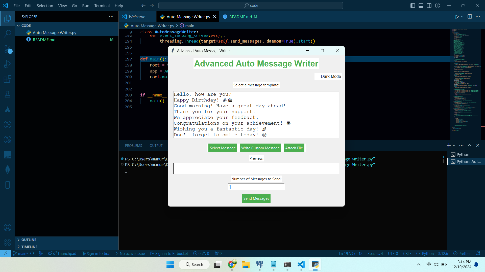

---

# Auto Message Writer - Advanced Version

## Overview
Auto Message Writer is a feature-rich Python application designed to automate the process of sending messages. With an intuitive Apple-inspired GUI, it provides both predefined message templates and the ability to create custom messages. The app is built with `tkinter` for the user interface and leverages `pyautogui` for message automation, making it a perfect tool for repetitive communication tasks.

---

## Features
- **Predefined Message Templates:** Select from a rich library of pre-written messages.
- **Custom Messages:** Write and send personalized messages.
- **Batch Messaging:** Automatically send a message multiple times to any active chat window.
- **Modern GUI:** Inspired by Apple's sleek design with a green-and-white theme.
- **Message Preview:** Preview your selected or custom message before sending.
- **Keyboard Shortcuts:** Quickly navigate the app with shortcuts for efficiency.

---

## Installation

### Prerequisites
Ensure you have Python 3.x installed on your machine. Additionally, the following Python libraries are required:
- `tkinter` (comes pre-installed with Python on most systems)
- `pyautogui`

### Install Dependencies
To install `pyautogui`, run:
```bash
pip install pyautogui
```

### Clone the Repository
```bash
git clone https://github.com/ShiboshreeRoy/-Auto-Message-Writer.git
cd Auto-Message-Writer
```

---

## Usage
1. **Run the Application:**
   Execute the script:
   ```bash
   python Auto-Message-Writer.py
   ```

2. **Select a Message Template:**
   - Choose a predefined message from the list.
   - Preview the message in the display section.

3. **Write a Custom Message:**
   - Click "Write Custom Message" to enter your personalized message.

4. **Send Messages:**
   - Click "Send Messages" to automate message delivery.
   - Input the number of times the message should be sent.
   - Switch to the chat window within 5 seconds for automation to start.

---

## GUI Preview
**Project Light Theme Version:**

**Project Dark Theme Version:**

---

## Shortcuts
- **`Ctrl + S`**: Select a predefined message.
- **`Ctrl + C`**: Write a custom message.
- **`Ctrl + R`**: Reset message selection.
- **`Ctrl + Q`**: Quit the application.

---

## Notes
- **Important:** Avoid interacting with the mouse or keyboard during automation to ensure accurate message delivery.
- **Chat Application Compatibility:** Works with most chat applications that support keyboard input.

---

## Contributing
Contributions are welcome! Feel free to fork the repository, submit issues, or make pull requests.

---

## License
This project is licensed under the MIT License. See the [LICENSE](LICENSE) file for details.

---

## Acknowledgments
- **`tkinter`** for creating the GUI.
- **`pyautogui`** for automation.
- Thanks to all contributors and users for their support.

---
